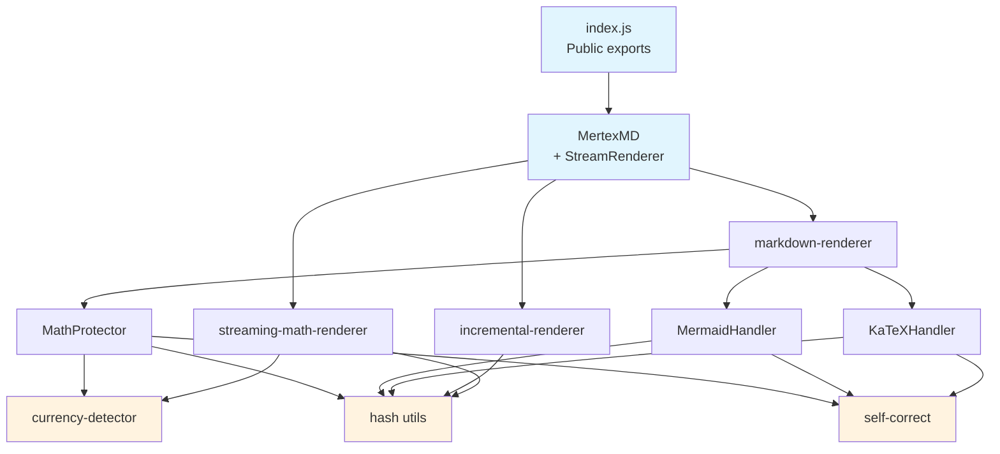

# Component Inventory

## Overview

mertex.md has 11 source files organised into four layers: the public API class, the core rendering pipeline, specialised handlers for math/diagram formats, and shared utilities. All components are plain ES modules with no framework dependencies.

## Components

### MertexMD (Public API)

**Location:** `src/mertex.js`
**Files:** 1 | **Lines:** ~226

The main class that consumers instantiate. Wraps the rendering pipeline with a clean API and manages configuration. Contains the `StreamRenderer` inner class for streaming use cases.

**Key files:**

| File | Purpose |
|------|---------|
| `src/mertex.js` | `MertexMD` class with `render()`, `renderFull()`, `createStreamRenderer()`, `renderInElement()`, `autoRender()`, `init()` |
| `src/index.js` | Re-exports all public API surfaces |

**Dependencies:** `markdown-renderer`, `math-protector`, `incremental-renderer`, `mermaid-handler`, `katex-handler`, `streaming-math-renderer`
**Dependents:** Consumer applications

---

### Markdown Renderer (Pipeline Orchestrator)

**Location:** `src/core/markdown-renderer.js`
**Files:** 1 | **Lines:** ~204

The central rendering function that coordinates the full protect-process-restore pipeline. Detects external libraries at runtime, delegates to handlers, and applies sanitisation.

**Key files:**

| File | Purpose |
|------|---------|
| `src/core/markdown-renderer.js` | `renderMarkdown()`, `renderMarkdownInElement()`, `autoRenderMarkdown()`, `initMarkdownRenderer()` |

**Pipeline steps:**
1. Protect mermaid blocks → `MermaidHandler.protect()`
2. Protect katex blocks → `KaTeXHandler.protect()`
3. Protect inline math → `MathProtector.protect()`
4. Parse markdown → `marked.parse()`
5. Highlight code → `hljs.highlight()`
6. Sanitise HTML → `DOMPurify.sanitize()`
7. Restore math → `MathProtector.restore()`

**Dependencies:** `math-protector`, `mermaid-handler`, `katex-handler`, external libs (marked, DOMPurify, highlight.js, KaTeX auto-render)
**Dependents:** `MertexMD`, `StreamRenderer`

---

### MathProtector

**Location:** `src/core/math-protector.js`
**Files:** 1 | **Lines:** ~436

The largest and most complex component. Identifies LaTeX math expressions in text, replaces them with unique placeholders (`::MATH_0::`) to survive Markdown processing, then restores and optionally renders them via KaTeX. Handles the critical `$` ambiguity between math and currency using `currency-detector.js`.

**Key files:**

| File | Purpose |
|------|---------|
| `src/core/math-protector.js` | `MathProtector` class: `protect()`, `restore()`, `extractAndReplace()` |

**Protection process:**
1. Protect currency ranges (`$50-$100`) with `::CUR0::` placeholders
2. Extract math by delimiter priority: `$$` → `\[..\]` → `\(..\)` → `$`
3. For each candidate, check currency heuristic before treating as math
4. Store originals in `mathMap` with base64-encoded content
5. Restore currency placeholders (they bypass math rendering)

**Dependencies:** `hash.js`, `currency-detector.js`, `self-correct.js`
**Dependents:** `markdown-renderer`

---

### Incremental Renderer

**Location:** `src/core/incremental-renderer.js`
**Files:** 1 | **Lines:** ~134

Manages streaming rendering by doing full DOM replacement on each update, but caching rendered Mermaid SVGs across re-renders to avoid expensive diagram re-rendering.

**Key files:**

| File | Purpose |
|------|---------|
| `src/core/incremental-renderer.js` | `IncrementalContentRenderer` class: `appendNewContent()`, `applySelectiveKaTeX()`, `getStats()` |

**Dependencies:** `hash.js`, external libs (mermaid, KaTeX)
**Dependents:** `StreamRenderer`

---

### MermaidHandler

**Location:** `src/handlers/mermaid-handler.js`
**Files:** 1 | **Lines:** ~174

Protects mermaid code blocks during Markdown processing and renders them as SVGs afterward. Supports 23 diagram types and distinguishes supported from unsupported/beta types.

**Key files:**

| File | Purpose |
|------|---------|
| `src/handlers/mermaid-handler.js` | `MermaidHandler` object: `protect()`, `renderInElement()`, `hasMermaidBlocks()`, `checkDiagramType()` |

**Supported diagram types:** graph, flowchart, sequenceDiagram, classDiagram, stateDiagram, erDiagram, journey, gantt, pie, quadrantChart, requirementDiagram, gitGraph, mindmap, timeline, zenuml, C4Context/Container/Component/Dynamic/Deployment, sankey, xychart, block

**Dependencies:** `hash.js`, `self-correct.js`, external lib (mermaid)
**Dependents:** `markdown-renderer`, `incremental-renderer`

---

### KaTeXHandler

**Location:** `src/handlers/katex-handler.js`
**Files:** 1 | **Lines:** ~125

Handles ` ```katex ` fenced code blocks — a distinct format from inline `$...$` math. Protects code blocks during Markdown processing and renders them as display-mode KaTeX afterward.

**Key files:**

| File | Purpose |
|------|---------|
| `src/handlers/katex-handler.js` | `KaTeXHandler` object: `protect()`, `renderInElement()`, `hasKaTeXBlocks()` |

**Dependencies:** `hash.js`, `self-correct.js`, external lib (KaTeX)
**Dependents:** `markdown-renderer`

---

### StreamingMathRenderer

**Location:** `src/handlers/streaming-math-renderer.js`
**Files:** 1 | **Lines:** ~192

Handles real-time KaTeX rendering during streaming by tracking which formulas have already been rendered (by signature hash) and only triggering re-renders when new formulas appear.

**Key files:**

| File | Purpose |
|------|---------|
| `src/handlers/streaming-math-renderer.js` | `StreamingMathRenderer` class: `processChunk()`, `extractFormulaSignatures()`, `renderMath()`, `finalRender()` |

**Dependencies:** `hash.js`, `currency-detector.js`, external lib (KaTeX auto-render)
**Dependents:** `StreamRenderer`

---

### Self-Correct Handler

**Location:** `src/handlers/self-correct.js`
**Files:** 1 | **Lines:** ~39

A small retry utility. When a Mermaid or KaTeX render fails, it calls a consumer-provided `fix(code, format, error)` callback to get corrected code, then retries the render. Enables LLM-powered auto-repair of broken syntax.

**Key files:**

| File | Purpose |
|------|---------|
| `src/handlers/self-correct.js` | `selfCorrectRender()` function |

**Dependencies:** None (pure logic)
**Dependents:** `math-protector`, `mermaid-handler`, `katex-handler`

---

### Currency Detector

**Location:** `src/utils/currency-detector.js`
**Files:** 1 | **Lines:** ~124

Heuristic module that determines whether content between `$` delimiters is a currency value or a math expression. Uses a cascade of checks: LaTeX syntax indicators, equation operators, English prose patterns, numeric formats, and fallback length-based rules.

**Key files:**

| File | Purpose |
|------|---------|
| `src/utils/currency-detector.js` | `looksLikeCurrency()`, `isCurrencyRange()` |

**Dependencies:** None (pure logic)
**Dependents:** `math-protector`, `streaming-math-renderer`

---

### Hash Utilities

**Location:** `src/utils/hash.js`
**Files:** 1 | **Lines:** ~49

Provides hash functions for generating unique placeholder IDs and base64 encode/decode that works in both browser and Node.js environments.

**Key files:**

| File | Purpose |
|------|---------|
| `src/utils/hash.js` | `hashCode()`, `hashBase36()`, `encodeBase64()`, `decodeBase64()` |

**Dependencies:** None (pure logic)
**Dependents:** `math-protector`, `incremental-renderer`, `mermaid-handler`, `katex-handler`, `streaming-math-renderer`

---

## Component Dependency Graph



## Configuration Points

All configuration flows through the `MertexMD` constructor options, which are merged with per-call overrides at render time.

| Option | Default | Location | Purpose |
|--------|---------|----------|---------|
| `breaks` | `true` | `mertex.js:16` | Convert line breaks to `<br>` |
| `gfm` | `true` | `mertex.js:17` | GitHub Flavoured Markdown |
| `headerIds` | `true` | `mertex.js:18` | Add IDs to headers |
| `katex` | `true` | `mertex.js:19` | Enable KaTeX math rendering |
| `mermaid` | `true` | `mertex.js:20` | Enable Mermaid diagram rendering |
| `highlight` | `true` | `mertex.js:21` | Enable syntax highlighting |
| `sanitize` | `true` | `mertex.js:22` | Enable DOMPurify sanitisation |
| `protectMath` | `true` | `mertex.js:23` | Protect math from Markdown corruption |
| `renderOnRestore` | `true` | `mertex.js:24` | Render math during restore phase |
| `selfCorrect.fix` | `undefined` | `mertex.js:29` | Callback for LLM-powered error correction |
| `selfCorrect.maxRetries` | `1` | `mertex.js:30` | Max correction attempts (capped at 3) |
