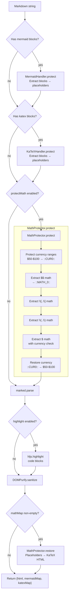
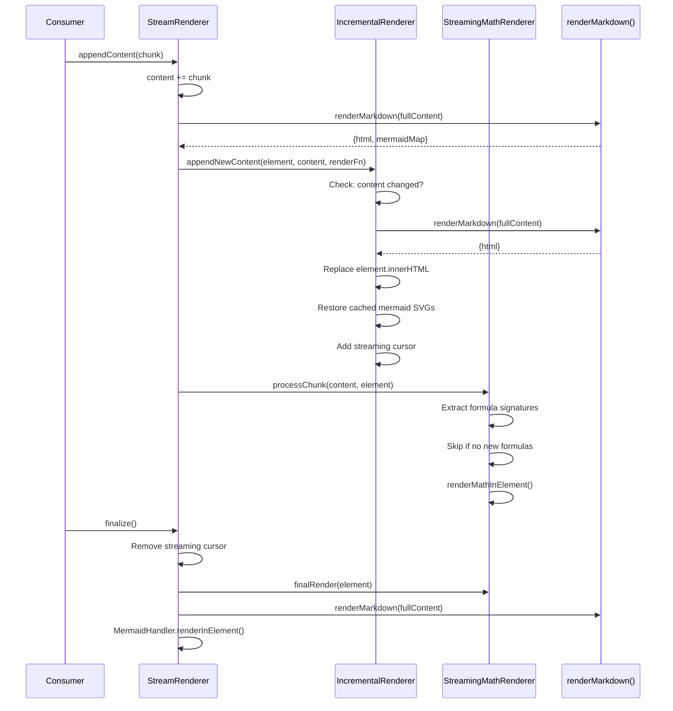
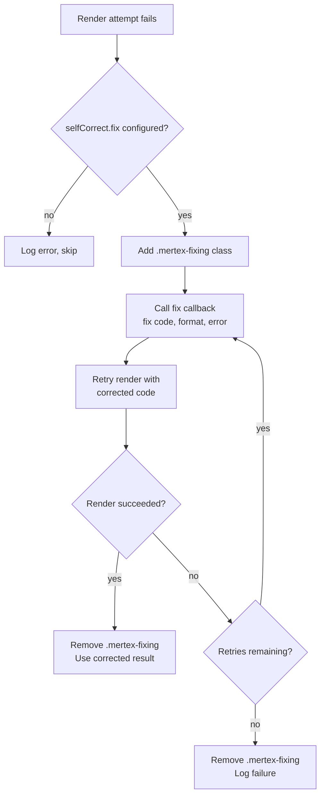
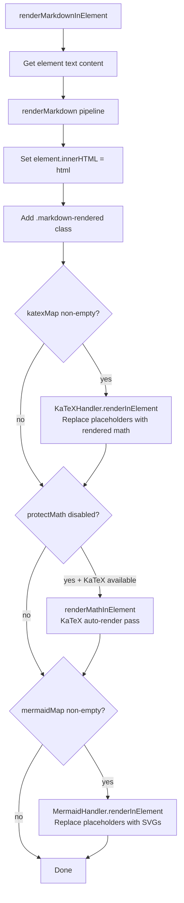

# Data Flow

## Overview

mertex.md has two major data flows: **static rendering** (one-shot Markdown to HTML) and **streaming rendering** (incremental chunks to live DOM). Both share the same core pipeline but differ in how they manage state across renders.

## Static Rendering

The primary flow for rendering a complete Markdown string to HTML.



**Entry point:** `MertexMD.render(markdown)` or `renderMarkdown(text, options)`
**Processing:** protect → parse → highlight → sanitise → restore
**Exit point:** Returns `{ html, mermaidMap, katexMap }` — HTML string with mermaid/katex maps for deferred DOM rendering

**Key transformation points:**

| Stage | Location | Transform |
|-------|----------|-----------|
| Currency protection | `math-protector.js:57-69` | `$50-$100` → `::CUR0::` |
| Math protection | `math-protector.js:78-83` | `$x^2$` → `::MATH_0::` |
| Mermaid protection | `mermaid-handler.js:84-88` | ` ```mermaid...``` ` → `<div class="mermaid-placeholder">` |
| KaTeX block protection | `katex-handler.js:29-38` | ` ```katex...``` ` → `<div class="katex-placeholder">` |
| Markdown parse | `markdown-renderer.js:93` | Protected Markdown → HTML |
| Code highlighting | `markdown-renderer.js:74-88` | `<code>` → `<code class="hljs">` |
| HTML sanitisation | `markdown-renderer.js:100-122` | Raw HTML → sanitised HTML (allowlisted tags/attrs) |
| Math restore | `math-protector.js:131-158` | `::MATH_0::` → KaTeX-rendered HTML |
| Currency restore | `math-protector.js:98-108` | `::CUR0::` → `$50-$100` (before markdown parse) |

---

## Streaming Rendering

For real-time content (e.g., LLM output arriving chunk by chunk), the `StreamRenderer` accumulates content and re-renders the full document on each chunk.



**Entry point:** `stream.appendContent(chunk)` called repeatedly
**Processing:** Each call re-renders the full accumulated content; the incremental renderer caches mermaid SVGs
**Exit point:** `stream.finalize()` triggers final math and mermaid rendering

**Key state tracked across chunks:**

| State | Location | Purpose |
|-------|----------|---------|
| `content` | `StreamRenderer` | Accumulated raw Markdown |
| `lastContent` | `IncrementalContentRenderer` | Previous render content (skip if unchanged) |
| `mermaidCache` | `IncrementalContentRenderer` | Map of mermaid ID → rendered SVG outerHTML |
| `seenFormulas` | `StreamingMathRenderer` | Set of formula signature hashes (skip re-render) |
| `processedFormulas` | `IncrementalContentRenderer` | Set of KaTeX formula hashes |

---

## Self-Correcting Render Flow

When a Mermaid or KaTeX render fails and `selfCorrect` is configured, the system enters a retry loop with consumer-provided error correction.



**Entry point:** Render failure in `MermaidHandler.renderInElement()`, `KaTeXHandler.renderInElement()`, or `MathProtector._renderMathWithSelfCorrect()`
**Processing:** Up to 3 fix-and-retry cycles via `selfCorrectRender()`
**Exit point:** `{ success: true, result, code }` or `{ success: false }`

---

## DOM Rendering Flow

When rendering into a DOM element (via `renderInElement` or `autoRender`), there is a two-phase process: first the HTML is set, then deferred rendering happens for mermaid diagrams and katex blocks.



> [!IMPORTANT]
> When `protectMath` is `true` (the default), the KaTeX auto-render pass is skipped. MathProtector already handled all math expressions during the pipeline, and running auto-render again would incorrectly pick up currency values like `$50`.
