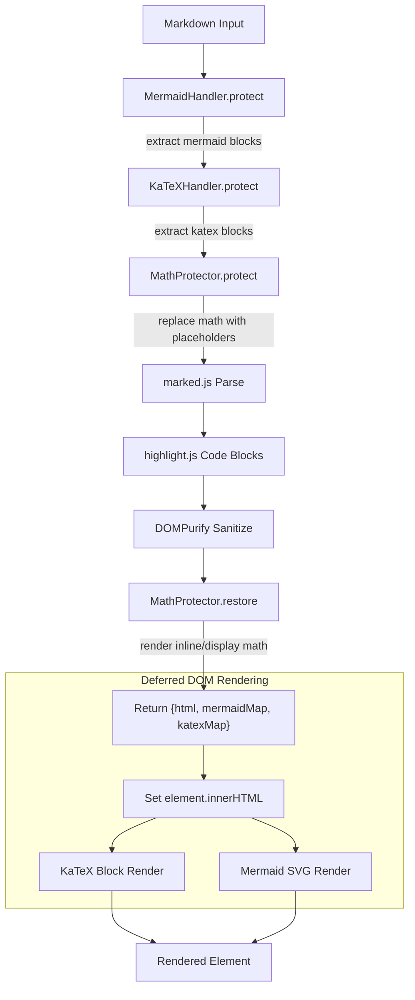

# Architecture Overview

## System Purpose

mertex.md is a JavaScript library that renders Markdown containing LaTeX math expressions and Mermaid diagrams into HTML. It handles the fundamental conflict between Markdown parsers and LaTeX syntax (both use `$`, `_`, `*`, etc.) by protecting math expressions before Markdown processing, then restoring and rendering them afterward. It supports both one-shot static rendering and chunk-by-chunk streaming for real-time content (e.g., LLM output).

## Tech Stack

| Layer | Technology | Version |
|-------|------------|---------|
| Language | JavaScript (ES modules) | ES2020+ |
| Markdown Parser | marked.js | >=9.0.0 (peer) |
| HTML Sanitizer | DOMPurify | >=3.0.0 (peer) |
| Math Renderer | KaTeX | optional (peer) |
| Diagram Renderer | Mermaid | optional (peer) |
| Syntax Highlighting | highlight.js | optional (peer) |
| Bundler | esbuild | ^0.19.0 (dev) |
| Test DOM | jsdom | ^27.4.0 (dev) |

## Architecture Style

Single-pass rendering pipeline with a protect-process-restore pattern. All modules are plain JavaScript — no framework, no build-time transforms, no TypeScript. External libraries are detected at runtime via global variable checks, supporting both browser `<script>` tags and ES module bundlers.

## System Diagram



> [!NOTE]
> The protection steps run sequentially — each operates on the output of the previous one. Mermaid and KaTeX block rendering are deferred: `renderMarkdown()` returns the maps, and `renderMarkdownInElement()` renders them into the DOM afterward.

## System Boundaries

**Owned by mertex.md:**
- Math/currency disambiguation and protection
- Rendering pipeline orchestration
- Streaming/incremental rendering coordination
- Self-correcting render retry logic
- Placeholder-based content protection system

**External (peer dependencies):**
- Markdown parsing (marked.js)
- HTML sanitisation (DOMPurify)
- Math rendering (KaTeX)
- Diagram rendering (Mermaid)
- Syntax highlighting (highlight.js)

mertex.md does not bundle any peer dependencies — consumers provide them. The library detects their presence at runtime and degrades gracefully when optional dependencies are absent.

## Key Design Decisions

### Protect-Process-Restore Pattern

LaTeX and Markdown share syntax characters (`$`, `_`, `*`, `{}`). Rather than writing a custom Markdown parser, mertex.md replaces math expressions with unique placeholders (`::MATH_0::`, `::MERMAID_abc::`) before passing content to marked.js, then restores and renders them afterward. This lets it use any standard Markdown parser.

### Currency Detection Heuristic

The `$` character is ambiguous — it starts both math expressions (`$x^2$`) and currency values (`$50`). The `currency-detector.js` module uses a heuristic scoring system that checks for LaTeX syntax indicators, equation operators, English prose patterns, and numeric formats to disambiguate. Currency ranges (`$50-$100`) are protected first to prevent them from being parsed as math.

### Runtime Library Detection

All external libraries are discovered via global variable checks (`typeof katex !== 'undefined'`), not `import` statements. This allows mertex.md to work in browser `<script>` tag environments where dependencies are loaded as globals, and in module bundler environments where tree-shaking applies.

### Streaming via Full Re-render

The streaming renderer re-renders the entire accumulated content on each chunk, rather than appending rendered fragments. This avoids state-tracking complexity at the cost of rendering the same content multiple times. Mermaid SVGs are cached across re-renders to avoid expensive re-rendering of diagrams.

## Codebase Metrics

| Metric | Value |
|--------|-------|
| Primary Language | JavaScript (ES modules) |
| Source Files | 11 |
| Source LOC | ~1,718 |
| Test Files | 5 |
| Test LOC | ~1,834 |
| Build Output | 4 bundles (ESM, UMD, minified, bundled) |
| External Dependencies | 2 required + 3 optional (peer) |
| Dev Dependencies | 2 (esbuild, jsdom) |

## Directory Structure

```
mertex.md/
├── src/
│   ├── index.js                         # Public API exports
│   ├── mertex.js                        # MertexMD class + StreamRenderer
│   ├── core/
│   │   ├── math-protector.js            # LaTeX ↔ currency disambiguation, placeholder system
│   │   ├── markdown-renderer.js         # Main rendering pipeline orchestration
│   │   └── incremental-renderer.js      # Streaming: full re-render with mermaid caching
│   ├── handlers/
│   │   ├── mermaid-handler.js           # Mermaid block protection and SVG rendering
│   │   ├── katex-handler.js             # KaTeX code block protection and rendering
│   │   ├── streaming-math-renderer.js   # Real-time KaTeX rendering during streaming
│   │   └── self-correct.js              # Retry loop with consumer-provided fix callback
│   └── utils/
│       ├── hash.js                      # Hash functions and base64 encode/decode
│       └── currency-detector.js         # Heuristic: is $X currency or math?
├── test/
│   ├── test-cases.js                    # Named test scenarios
│   ├── index.html                       # Manual browser test harness
│   ├── styles.css                       # Test harness styling
│   └── unit/
│       ├── math-rendering.test.js       # Main test suite (~100+ tests)
│       ├── test-runner.js               # Custom lightweight test framework
│       ├── test-runner.html             # Browser-based test runner
│       ├── run-tests-node.cjs           # Node.js test runner (vm-based ES module loading)
│       └── stress-test.cjs              # Stress test scenarios
├── build.js                             # esbuild configuration (4 output formats)
├── package.json                         # NPM manifest with peer dependencies
├── README.md                            # User-facing documentation
└── LICENSE                              # MIT
```
