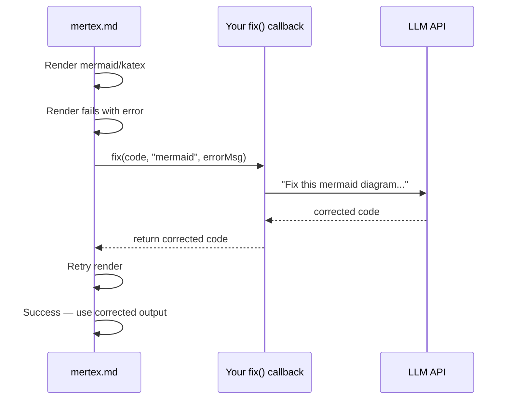

# Self-Correcting Render

LLMs frequently generate Mermaid diagrams and KaTeX expressions with syntax errors — missing semicolons, invalid node names, unbalanced braces. Rather than showing a broken placeholder, mertex.md can call a consumer-provided callback to fix the broken code and retry the render automatically.

## How It Works

1. mertex.md attempts to render a Mermaid diagram or KaTeX expression
2. The render fails with an error (e.g., `Parse error on line 3`)
3. mertex.md calls your `fix(code, format, error)` callback with the broken source and error
4. Your callback returns corrected code (typically by calling an LLM)
5. mertex.md retries the render with the corrected code
6. If it still fails, steps 3-5 repeat up to `maxRetries` times



## Basic Setup

```javascript
import { MertexMD } from 'mertex.md';

const renderer = new MertexMD({
  selfCorrect: {
    fix: async (code, format, error) => {
      // code:   the broken source code
      // format: "mermaid" or "katex"
      // error:  the error message from the failed render
      // Return: the corrected code as a string
      return await fixWithLLM(code, format, error);
    },
    maxRetries: 2  // try up to 2 corrections (default: 1, max: 3)
  }
});
```

## Implementing the Fix Callback

### With the Anthropic SDK (Claude)

```javascript
import Anthropic from '@anthropic-ai/sdk';

const client = new Anthropic();

async function fixWithClaude(code, format, error) {
  const systemPrompt = format === 'mermaid'
    ? `You are a Mermaid diagram syntax expert. Fix the broken diagram code.
       Return ONLY the corrected mermaid code — no explanation, no markdown fences.`
    : `You are a LaTeX/KaTeX syntax expert. Fix the broken math expression.
       Return ONLY the corrected LaTeX code — no explanation, no delimiters.`;

  const response = await client.messages.create({
    model: 'claude-haiku-4-5-20251001',
    max_tokens: 1024,
    system: systemPrompt,
    messages: [{
      role: 'user',
      content: `This ${format} code failed to render.

Code:
${code}

Error:
${error}

Return only the fixed code.`
    }]
  });

  return response.content[0].text.trim();
}

const renderer = new MertexMD({
  selfCorrect: {
    fix: fixWithClaude,
    maxRetries: 2
  }
});
```

> [!TIP]
> Use a fast, cheap model for the fix callback. The fix is a focused task (correct a syntax error given the error message) that doesn't need a large model. Claude Haiku or GPT-4o-mini work well and keep latency low.

### With the OpenAI SDK

```javascript
import OpenAI from 'openai';

const client = new OpenAI();

async function fixWithOpenAI(code, format, error) {
  const response = await client.chat.completions.create({
    model: 'gpt-4o-mini',
    messages: [
      {
        role: 'system',
        content: `Fix broken ${format} code. Return ONLY the corrected code, nothing else.`
      },
      {
        role: 'user',
        content: `Code:\n${code}\n\nError:\n${error}`
      }
    ],
    temperature: 0
  });

  return response.choices[0].message.content.trim();
}
```

### Without an LLM (Rule-Based Fixes)

For common errors, you can fix them without calling an LLM:

```javascript
function fixWithRules(code, format, error) {
  if (format === 'mermaid') {
    let fixed = code;

    // Common: missing semicolons at end of lines
    fixed = fixed.replace(/(\w)\s*\n/g, '$1;\n');

    // Common: unquoted node labels with special characters
    fixed = fixed.replace(/\[([^\]]*[()][^\]]*)\]/g, '["$1"]');

    // Common: invalid characters in node IDs
    fixed = fixed.replace(/(\w+)\s*-->/g, (match, id) => {
      return id.replace(/[^a-zA-Z0-9_]/g, '_') + ' -->';
    });

    return fixed;
  }

  if (format === 'katex') {
    let fixed = code;

    // Common: unbalanced braces
    const open = (fixed.match(/\{/g) || []).length;
    const close = (fixed.match(/\}/g) || []).length;
    if (open > close) fixed += '}'.repeat(open - close);

    // Common: \\ outside of environments
    if (!fixed.includes('\\begin') && fixed.includes('\\\\')) {
      fixed = fixed.replace(/\\\\/g, '\\newline');
    }

    return fixed;
  }

  return code;
}
```

### Hybrid Approach

Try rule-based fixes first, fall back to LLM:

```javascript
async function fixHybrid(code, format, error) {
  // Try cheap rule-based fix first
  const ruleFix = fixWithRules(code, format, error);
  if (ruleFix !== code) return ruleFix;

  // Fall back to LLM for complex issues
  return await fixWithClaude(code, format, error);
}

const renderer = new MertexMD({
  selfCorrect: {
    fix: fixHybrid,
    maxRetries: 2  // attempt 1: rules, attempt 2: LLM
  }
});
```

---

## Prompt Engineering Tips

The quality of the fix depends on the prompt. Key principles:

1. **Include the error message** — mertex.md passes it as the third argument. The error often pinpoints the exact line and issue.

2. **Ask for code only** — LLMs tend to wrap responses in markdown fences or add explanations. Be explicit about returning only the fixed code.

3. **Specify the format** — "Mermaid" and "KaTeX" are specific syntaxes. The LLM needs to know which one to fix.

4. **Use low temperature** — This is a correction task, not a creative one. Temperature 0 gives the most reliable fixes.

5. **Strip markdown fences from the response** — Even with instructions, LLMs sometimes wrap code in fences. Handle this defensively:

```javascript
async function fixWithLLM(code, format, error) {
  const response = await callLLM(code, format, error);
  let fixed = response.trim();

  // Strip markdown fences if the LLM added them
  const fenceMatch = fixed.match(/^```(?:\w*)\n([\s\S]*?)\n```$/);
  if (fenceMatch) fixed = fenceMatch[1];

  return fixed;
}
```

---

## CSS for the Fixing State

While the fix callback is running, the placeholder element receives the `.mertex-fixing` CSS class. Use this to show a loading indicator:

```css
/* Dim the placeholder while fixing */
.mertex-fixing {
  opacity: 0.5;
  position: relative;
  min-height: 60px;
}

/* Overlay a loading message */
.mertex-fixing::after {
  content: 'Fixing syntax...';
  position: absolute;
  top: 50%;
  left: 50%;
  transform: translate(-50%, -50%);
  font-size: 0.85em;
  color: #666;
}
```

Or with a spinner:

```css
.mertex-fixing::after {
  content: '';
  position: absolute;
  top: 50%;
  left: 50%;
  width: 24px;
  height: 24px;
  margin: -12px 0 0 -12px;
  border: 3px solid #ddd;
  border-top-color: #333;
  border-radius: 50%;
  animation: mertex-spin 0.6s linear infinite;
}

@keyframes mertex-spin {
  to { transform: rotate(360deg); }
}
```

The class is removed when the correction completes (success or failure).

---

## Using selfCorrectRender Directly

The self-correction logic is also exported as a standalone utility for custom rendering pipelines:

```javascript
import { selfCorrectRender } from 'mertex.md';

const result = await selfCorrectRender(
  brokenCode,     // the broken source code
  'mermaid',      // "mermaid" or "katex"
  errorMessage,   // the error from the failed render
  async (code) => {
    // Your render function — must return the rendered result or throw
    const { svg } = await mermaid.render('diagram-1', code);
    return svg;
  },
  {
    fix: fixWithClaude,
    maxRetries: 2
  }
);

if (result.success) {
  container.innerHTML = result.result;  // the rendered SVG
  console.log('Fixed code:', result.code);  // the corrected source
} else {
  container.textContent = 'Diagram failed to render';
}
```

---

## Choosing maxRetries

| Value | When to use |
|-------|-------------|
| `1` | Default. Good for simple syntax errors where one fix attempt usually works. Keeps latency low. |
| `2` | Recommended for LLM-generated content. The first attempt may fix the obvious error but reveal a second issue underneath. |
| `3` | Maximum. Use sparingly — three sequential LLM calls add significant latency. Only worthwhile for complex diagrams where partial fixes are common. |

> [!WARNING]
> Each retry is a sequential LLM call. With `maxRetries: 3`, a failing diagram could add 3-5 seconds of latency. For streaming UIs, prefer `maxRetries: 1` or `2` and accept that some diagrams may fail.
